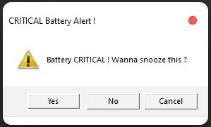
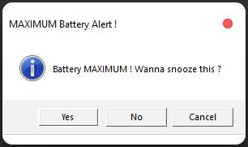
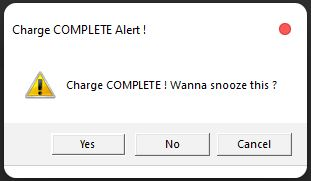

# Battery-Zira

A Windows based program that gives voice reminder based on *low*, *critical*, *maximum* and *fully charged* battery levels in a laptop

# Installation

1. [Download](https://github.com/JustABeginning/Battery-Zira/releases) all the files and extract/save them in a folder (Give it any name) [All the files must be in the same folder].
2. Create a *shortcut* of `Launch_BAT.bat` file.
3. Press `Win+R` from keyboard or, open windows run menu, then type `shell:startup` and press enter.
4. Save the shortcut created in **step-2** in the location which opens in **step-3**.
5. Return back to the folder of **step-1** and click on `Launch_BAT.bat` file.

:point_right: Steps **1 to 4** have been shown below :point_down:

## Note

+ In order to set custom values, use `Custom_Battery_Level.bat` file.

+ To skip the value of a parameter, press enter. This will accept the default/recently saved (if any) value for that parameter.
+ Only *non-zero* **positive** values are accepted for any parameter.
+ The DEFAULT VALUES are:
	+ Low battery level - 40 %
	+ Critical battery level - 20 %
	+ Maximum battery level - 80 %
	+ Snooze time - 1 minute

# Uninstallation

1. Delete the `Launch_BAT.bat` *shortcut* from the location which opens in **step-3** of ***Installation***.
2. Restart the Computer.

# :clap: A Big Thanks To

## Stargazers

